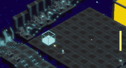
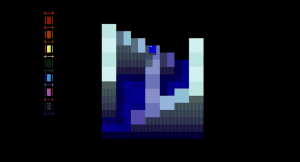
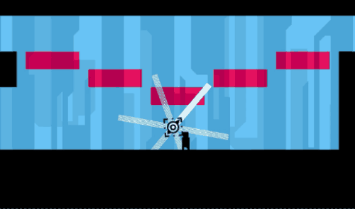
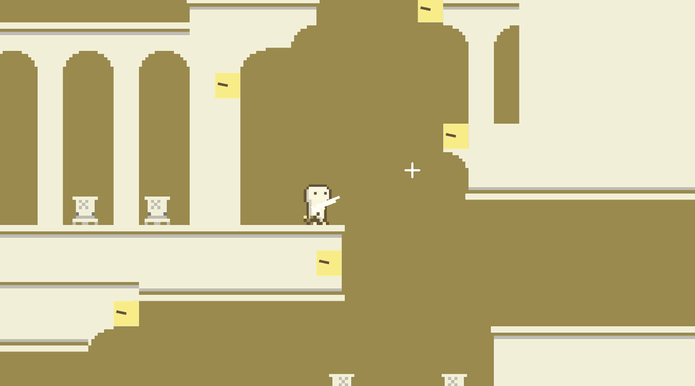

## 「VEIL」
### [github.com/tkou2027/dx28-pinball](https://github.com/tkou2027/dx28-pinball)

* 3Dアクションゲーム + フレームワーク
* 2025/11~2025/02 個人制作
* C++・DirectX11
* プロトタイプ版は学内コンテストで技術力賞受賞

----

## 「デジカード」
### [github.com/tkou2027/at28-dash](https://github.com/tkou2027/at28-dash)

* 3Dアクションゲーム
* 2025/03 チーム制作
* C++・DirectX11

----

## 「MELT」
### [github.com/tkou2027/hew-cp18](https://github.com/tkou2027/hew-cp18)

* 3Dパズルゲーム + フレームワーク
* 2025/01~2025/03 個人制作
* C・C++
* 学内コンテストで銀賞受賞

----

## 「雨の中」
### [github.com/tkou2027/gm19-platformer](https://github.com/tkou2027/gm19-platformer)

* 2Dアクションパズルゲーム
* 2025/07~2025/08 個人制作
* C++・OpenGL
* 制作期間 2025/07~2025/08
* 学内コンテストで技術力賞受賞

----

## 「Ruins of Time」
### [github.com/tkou2027/al18-shooting](https://github.com/tkou2027/al18-shooting)

* 2Dアクションパズルゲーム
* 2024/11 個人制作
* C#・Unity
